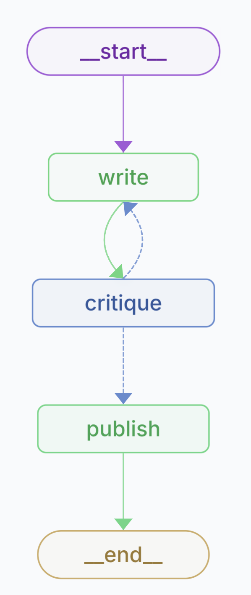

# Langgraph AI-Assisted Article Writing and Critiquing

This project demonstrates the use of AI agents to assist in the process of writing and critiquing articles. The aim is to improve the overall quality of the articles by leveraging the capabilities of AI to provide feedback and suggestions for revision.



## Overview

The project consists of two main AI agents:

1. **WriterAgent**: Responsible for generating an initial draft of an article based on a given topic and word count.
2. **CritiqueAgent**: Analyses the generated article and provides a critique, assessing factors such as accuracy, grammar, relevance, and overall quality.

The agents work together in a iterative process, with the WriterAgent revising the article based on the feedback provided by the CritiqueAgent until a satisfactory overall score is achieved.

By using AI agents to assist in the writing and critiquing process, this project aims to:

- Improve the quality and coherence of the generated articles
- Reduce the occurrence of hallucinations or factual inaccuracies
- Provide a structured approach to article revision and improvement
- Serve as a guardrail to ensure the articles meet certain quality standards

## Getting Started

To run this project locally, follow these steps:

1. Clone the repository:

   ```bash
   git clone https://github.com/jagreehal/langgraph-article-writer-critiquer.git
   ```

2. Navigate to the project directory:

   ```bash
   cd langgraph-article-writer-critiquer
   ```

3. Install the required dependencies using Poetry:

   ```bash
   poetry install
   ```

4. Set up the necessary environment variables:

   - Create a `.env` file in the project root.
   - Add the required environment variables to the `.env` file (e.g., Langsmith).

5. Run the script:

   ```bash
   poetry run python langgraph-article-writer-critiquer/main.py
   ```

   The script will initiate the article writing and critiquing workflow, generating an article on the specified topic and iteratively revising it based on the AI-generated critiques.

## Dependencies

The project relies on the following main dependencies:

- `langchain-ollama`: Language model interface for generating articles and critiques.
- `langchain-core`: Core components for working with language models.
- `langgraph`: Graph-based workflow management for coordinating the AI agents.

For a complete list of dependencies, refer to the `pyproject.toml` file.
